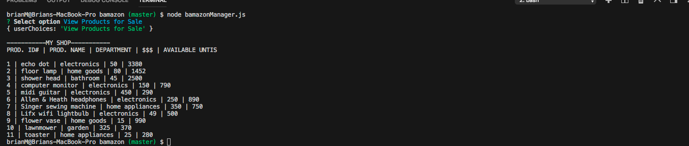
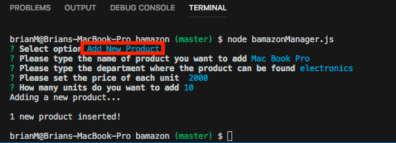
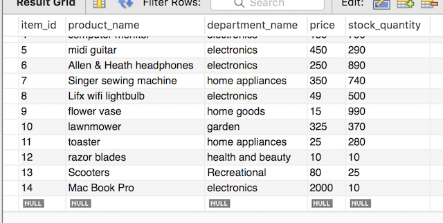

# Homework Assignment -  bAmazon

# Level One - CUSTOMER VIEW

This is my bAmazon homework assignment. I created a database in mySQL and populated it with over ten different items. When you type node bamazonCustomer.js 
into the command line. It will display those items along with their ID number, Item name, department, price per unit, and the remaining quantity.

Then the user is prompted to enter the item_id and desired quantity to make a purchase, after which the app will adjust the inventory and also display the total cost of the purchase. The database will be adjusted according to the purchase and the next time the program is run the inventory will reflect the previous purchase.

If the user tries to buy more than what is in available stock, the user will get a message telling them that the inventory levels are insufficient to complete the purchase, and the inventory remains the same.

# Level Two - MANAGER VIEW

When you run node bamazonManager.js in the terminal, the store manager has 4 options to choose from 
1. View Products for sale
2. View low inventory (below 500 units)
3. Add to the inventory
4. Add a new product

**1.** If the user selects View Products for sale, the user will get a current snapshot of all items and their quantities.

**2.** If the user selects View Low Inventory, the user will get a list of those products with a stock level below 500 units.

**3.** If the user selects Add to the Inventory, the user will be prompted to input the item ID and the quantity they wish to add. Then the new stock quantity will be displayed and also updated in the database.

**4.** If the user selects Add New Product, the user will be prompted to input 
                                                        a. product name
                                                        b. department in which it can be found
                                                        c. price per unit
                                                        d. quantity to add

The new product will automatically be given an item_id by the AUTO_INCREMENT code, and the new product with the chosen values will be added to the database.

# THANK YOU FOR SHOPPING WITH bAMAZON !!!